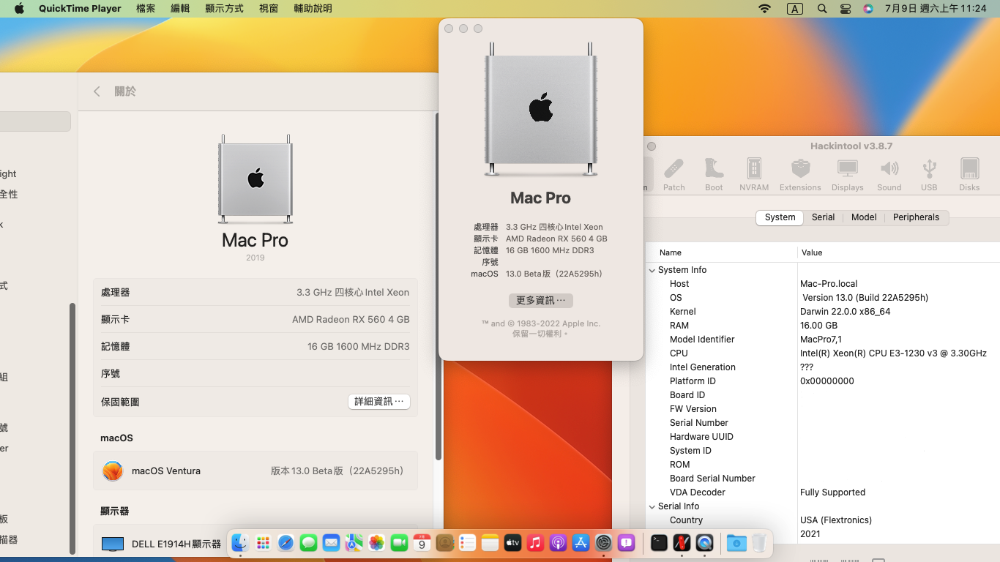
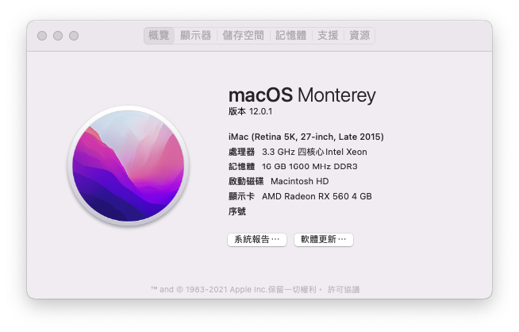

# GA-B85M-D3H-Haswell-Hackintosh

## 🖥️Device

| Motherboard | GA B85M-D3H |
|------------|-------------------------------|
| CPU | Xeon E3-1230v3 |
| dGPU | AMD Radeon RX560 4G |
| RAM | 16GB |
| Audio | Realtek ALC892 |
| WIFI／Bluetooth | FV-T919(BCM94360cd) |
| Ethernet | Realtek® 8111F |
| BIOS Version | F12 |

## 📀System

### Noteice:
iGPU with Haswell cpu cannot be driven on macOS Ventura, dGPU needs to be installed
 
|  |
|------------|
| <a href="https://www.apple.com/tw/macos/macos-ventura-preview/">macOS Ventura 13(beta) |
| <a href="https://github.com/acidanthera/OpenCorePkg/releases/tag/0.8.1">Opencore 0.8.1 |
| <a href="https://dortania.github.io/OpenCore-Install-Guide/extras/smbios-support.html#how-to-decide">iMac 18.2 |
 
- Download:

|  |
|------------|
| <a href="https://www.apple.com/tw/macos/monterey/">macOS Monterey 12.4 |
| <a href="https://github.com/acidanthera/OpenCorePkg/releases/tag/0.8.1">Opencore 0.8.1 |
| <a href="https://dortania.github.io/OpenCore-Install-Guide/extras/smbios-support.html#how-to-decide">iMac 17.1 | 
 
- Download:
  
## 💡Device status
### Works：
- [x] Graphics
- [x] USB
- [x] Sleep
- [x] WiFi
- [x] Speakers
- [x] Microphone
- [x] Bluetooth
- [x] Ethernet
- [x] AirDrop
### Unkown：
- [ ] Apple Services

## 🛠️Setting BIOS

#### CFG lock:
 
- The BIOS preset is unlocked

#### BIOS Features:

- Boot Mode Selection：`UEFI Only`

- Storge Boot Option Control：`UEFI Only`

- Advanced/System Agent Configuration/VT-d：`Disabled`

#### Peripherals:

- XHCI Mode：`Enabled`

- Audio Controller：`Enabled`

- EHCI Hand-off：`Enabled`
 
- SATA Configuration/SATA Mode Selection：`AHCI`

- Super IO Configuration/Serial Port A：`Disabled`
 
#### Powrer Management:
 
- ErP：`Enabled`
